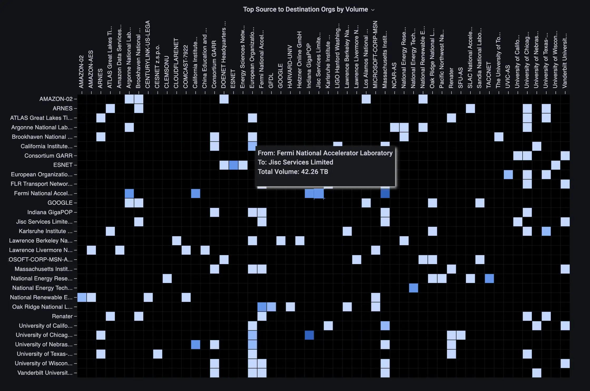

# Matrix Panel Plugin

A Grafana panel that renders a 2D matrix showing relationships between two categorical fields (e.g. source x destination). Cell color is driven by a numeric value field and Grafana's threshold system.

> **Note:** This plugin is designed for categorical data, not time series. It will not render if there are more than 200 unique rows or columns.



This is a fork of [esnet/esnet-matrix-panel](https://github.com/esnet/esnet-matrix-panel)  -- thanks to ESnet for the original plugin. See [CHANGELOG.md](CHANGELOG.md) for a full list of changes relative to upstream.

## Building

Requires [Bun](https://bun.sh) (v1.0+). Install it with:

```bash
curl -fsSL https://bun.sh/install | bash
```

Then:

```bash
# Install type dependencies (only needed once, or after changing package.json)
bun install

# Development build with file watching
bun run dev

# Production build (minified)
bun run build

# Type-check without emitting
bun run typecheck
```

Output goes to `dist/`.

## Installing

```bash
rsync -a --delete dist/ /var/lib/grafana/plugins/esnet-matrix-panel/ 
sudo systemctl restart grafana-server # on server
```

Then hard-reload the browser (Ctrl+Shift+R) to pick up the new module.

## Panel Options

### Row/Column Options

| Option | Description |
|--------|-------------|
| **Sort Type** | How row and column labels are ordered: *None*, *Natural ascending* (e.g. "node2" before "node10"), or *Natural descending*. |
| **Use Static Row/Column Lists** | When enabled, provide fixed comma-separated row and column names instead of deriving them from the data. |
| **Rows / Columns / Value Field** | Field pickers for the data fields that map to matrix rows, columns, and cell values. Uses a 3-way fallback: `field.name` -> `displayNameFromDS` -> `getFieldDisplayName()`. |

### Display

| Option | Description |
|--------|-------------|
| **Show Legend** | Adds a legend below the matrix. |
| **Legend Type** | *Range* shows a gradient bar with min/max labels. *Categorical* shows colored circles for each distinct threshold value (wraps with flexbox). |
| **Source / Target / Value Text** | Custom labels shown in the cell tooltip (defaults: "From", "To", "Value"). |
| **Fit to Panel Width** | Scales the matrix down via SVG viewBox so all columns fit within the panel width. |
| **Extra Tooltip Fields** | Comma-separated field names (e.g. `Loss,p10,p90`) to include as additional rows in the cell tooltip. |
| **Cell Size** | Width and height of each cell in pixels (10-50, default 15). |
| **Cell Padding** | Relative padding between cells (0-100, default 5). |
| **Text Length** | Max characters before label truncation with "..." (default 50). |
| **Text Size** | Font size for axis labels in scaled em units (default 10). |
| **Null Color** | Color for cells where the query returned null. |
| **No Data Color** | Color for source/target pairs with no matching data. |

### Colors

Cell color is determined by the numeric value field and the **Thresholds** configured under Grafana's standard *Field Configuration* options.

### Link Options

| Option | Description |
|--------|-------------|
| **Add Data Link** | When enabled, clicking a cell navigates to a configured URL. |
| **Link URL** | Base URL to navigate to on cell click (e.g. `/d/my-dashboard?`). Must end with `?` so that variable parameters are appended correctly. |
| **Variable 1** | Name of a Grafana template variable that receives the row (source) label. Appended as `&var-<name>=<row>`. |
| **Variable 2** | Name of a Grafana template variable that receives the column (target) label. Appended as `&var-<name>=<col>`. |

## Test Dashboard

A comprehensive test dashboard is included at [`doc/test-dashboard.json`](doc/test-dashboard.json). It uses the built-in **TestData** datasource to exercise every panel option without needing a real data source.

To use it:

1. In Grafana, go to **Connections -> Data sources -> Add data source** and add **TestData DB** (search for "TestData"). No configuration needed.
2. Import the dashboard via **Dashboards -> Import**, then paste or upload `doc/test-dashboard.json`.

The dashboard contains 8 panels covering:

| Panel | What it tests |
|-------|---------------|
| 1. Categorical Legend | `showLegend` + categorical type with colored circles |
| 2. Data Links | Cell click -> URL with template variables |
| 3. Static Rows/Columns | Fixed row/column lists via `staticRows`/`staticColumns` |
| 4a-c. Sort Variants | `none`, `natural-asc`, `natural-desc` side by side |
| 5. Null + Missing Data | `nullColor` and `defaultColor` rendering |
| 6. Field Pickers | Explicit `sourceField`/`targetField`/`valueField` selection |
| 7. Migration | Panel saved without `sortType` (tests migration handler) |
| 8. Empty Query | No data -> "No Data" message |
